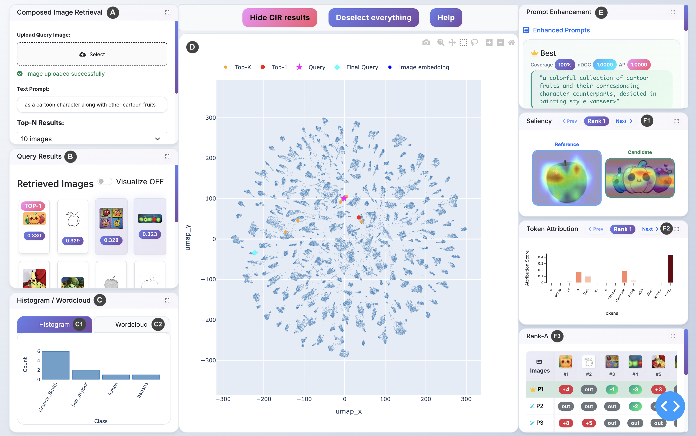

# InfoCIR – Interactive Composed Image Retrieval Dashboard

## 📄 Associated Publication

This repository contains the official implementation of the accepted conference paper:

> **InfoCIR: Multimedia Analysis for Composed Image Retrieval**  
> Paper ID: **7973**  
> Accepted at **IEEE PacificVis 2026 (Conference Papers Track)**

[](https://arxiv.org/abs/2602.13402v1)

This repository hosts the official implementation of the paper.

**InfoCIR** is an open-source web application (built with Plotly Dash) for exploring a *Composed Image Retrieval (CIR)* system through interactive visualizations and explainability tools. It integrates a state-of-the-art CIR model (SEARLE) with a rich dashboard that lets you query by combining an image + text description, visualize the results in an embedding space, analyze class distributions, and refine your text prompts with AI assistance. The goal is to help users understand **why** certain images are retrieved and how slight changes in wording can affect the results, by coupling retrieval with explainability and prompt engineering in one interface.


<div align="center">
  
  <p><em>
    The user interface of our system consists of six main panels. (A) The <strong>Composed Image Retrieval Panel</strong> allows users to input an image and a text prompt and select the number of images k to be retrieved. (B) The <strong>Query Results Panel</strong> displays the top-k images ranked by similarity; any image can be clicked to mark it as an ideal target for prompt refinement. (C) The <strong>Histogram / Wordcloud Panel</strong> includes a class-frequency histogram (C<sub>1</sub>) and a word cloud (C<sub>2</sub>), summarizing labels within the current top-k. (D) The central <strong>Embedding View</strong> shows a 2D UMAP projection of the dataset, highlighting the reference image, the composed query embedding, and the top-k results. (E) The <strong>Prompt Enhancement Panel</strong> proposes alternative prompts conditioned on the selected ideals, using an LLM and retrieval metrics. (F) The <strong>Explanation Panel</strong> visualizes model attribution using a saliency map (F<sub>1</sub>), a token attribution bar chart (F<sub>2</sub>), and a Rank-Δ heatmap (F<sub>3</sub>).
  </em></p>
</div>


## 🌟 Key Features

### 🔍 **Composed Image Retrieval**
- **Reference Image + Text Query**: Upload an image and describe desired modifications (e.g., "make it red", "add a hat")
- **SEARLE Integration**: Uses pre-trained SEARLE models for high-quality composed queries
- **Multiple Model Support**: SEARLE, SEARLE-XL, Phi networks, and OTI methods
- **Real-time Search**: Interactive search with adjustable top-K results

### 🎯 **Explainable AI & Saliency**
- **Visual Explanations**: GradECLIP-based saliency maps showing which image regions influence retrieval
- **Text Attribution**: Token-level attribution showing which words matter most
- **Reference vs Candidate Analysis**: Compare attention patterns between query and results
- **Interactive Navigation**: Browse through saliency maps for multiple retrieved images

### 🚀 **Intelligent Prompt Enhancement**
- **Context-Aware Generation**: Automatically enhance prompts using visual context from selected images
- **Multi-Candidate Analysis**: Generate and compare multiple enhanced prompts
- **Performance Metrics**: NDCG, mAP, and MRR evaluation of prompt improvements
- **Rank Delta Analysis**: Visualize how different prompts affect retrieval rankings

### 📊 **Interactive Visualizations**
- **UMAP Projections**: 2D visualization of high-dimensional image embeddings
- **Smart Clustering**: Enhanced UMAP with debiasing techniques for better semantic grouping
- **Gallery View**: Responsive image grid with selection and filtering
- **Word Clouds**: Dynamic visualization of class distributions
- **Histograms**: Interactive class frequency analysis
- **Scatterplot**: Multi-selection and zoom-responsive visualizations

## 🛠️ Installation

### Prerequisites
- **Python 3.8+** (tested with 3.8-3.11)
- **CUDA-capable GPU** (recommended for optimal performance)
- **8GB+ RAM** (16GB+ recommended for large datasets)

### 1. Clone the Repository
```bash
git clone <repository-url>
cd multimedia-analytics
```

### 2. Environment Setup
```bash
# Create virtual environment
python -m venv venv
source venv/bin/activate  # On Windows: venv\Scripts\activate
cd cir_app
# Install dependencies
pip install -r requirements.txt
```

### 3. SEARLE Model Setup
The app automatically downloads SEARLE models via PyTorch Hub. For offline usage:
```bash
# Pre-download SEARLE models
python -c "import torch; torch.hub.load('miccunifi/SEARLE', 'searle', backbone='ViT-B/32')"
python -c "import torch; torch.hub.load('miccunifi/SEARLE', 'searle', backbone='ViT-L/14')"
```

### 4. Dataset Configuration
You need to have your dataset somewhere on your system with this structure:
```
/your/path/to/dataset/
├── class1_dir/           # class directory
├── class2_dir/           # class directory
├── ...
└── class_names.csv       # CSV with columns: dir_name,class_name
```

The `class_names.csv` should look like:
```csv
dir_name,class_name
class1_dir,Class 1 Name
class2_dir,Class 2 Name
...
```

Then, configure the dataset path:

Edit `src/config.py` and change:
```python
DATASET_ROOT_PATH = '/your/actual/path/to/dataset'
```

- You can download Imagenet-R dataset from [here](https://people.eecs.berkeley.edu/~hendrycks/imagenet-r.tar).
- The corresponding **class_names.csv** can be found [here](cir_app/data/class_names.csv).


## 🚀 Quick Start

### 1. Launch the Application
```bash
cd cir_app
python run.py
```
The app will be available at `http://localhost:8051`

### 2. First-Time Setup
1. **Dataset Processing**: The app will automatically process your dataset on first run
2. **Feature Extraction**: CLIP embeddings and UMAP projections will be generated
3. **Database Creation**: Search index will be built for fast retrieval

### 3. Basic Usage
1. **Upload Image**: Click the upload area and select a reference image
2. **Enter Query**: Type a modification description (e.g., "wearing sunglasses")
3. **Search**: Click "Search" to find similar images
4. **Explore Results**: Use visualizations to understand retrieval patterns
5. **Enhance**: Select ideal results and click "Enhance Prompt" for better queries

## 📋 Detailed Usage Guide

### 🔍 **Composed Image Retrieval Workflow**

#### Step 1: Query Construction
```
Reference Image + Text Modification → Composed Query
Example: [Dog Image] + "wearing a red collar" → Search for dogs with red collars
```

#### Step 2: Search and Analysis
- **View Results**: Top-K most similar images ranked by semantic similarity
- **Visualize Embeddings**: See how your query relates to the dataset in 2D space
- **Analyze Patterns**: Use histogram and word clouds to understand result distributions

#### Step 3: Explainability
- **Saliency Maps**: See which parts of images drive similarity
- **Text Attribution**: Understand which words are most influential
- **Comparative Analysis**: Compare attention between reference and candidates

#### Step 4: Iterative Improvement
- **Select Ideal Results**: Choose images that best match your intent
- **Enhance Prompts**: Generate contextually-aware improved queries
- **Compare Performance**: Use metrics to validate improvements

### 🎛️ **Widget Interactions**

#### **Gallery Widget**
- **Single Selection**: Click any image to select and highlight in visualizations
- **Multi-Selection**: The gallery allows selecting multiple images at the same time 
- **Context Menu**: Right-click for additional options

#### **Scatterplot Widget**
- **Zoom**: Click +/- buttons or select are to zoom
- **Pan**: Click and drag to navigate
- **Selection**: Lasso or box select multiple points
- **Class Highlighting**: Click histogram bars to highlight classes

#### **Prompt Enhancement**
- **Candidate Generation**: System generates multiple enhanced prompts
- **Performance Metrics**: NDCG@K, mAP@K, MRR, Coverage, Mean Rank and Mean Similarity scores for each candidate
- **Visual Comparison**: Side-by-side results for prompt comparison

### 🔧 **Advanced Features**

#### **Custom Model Integration**
```python
# Add new CIR models in src/shared/cir_systems.py
class CustomCIRSystem:
    def query(self, reference_image_path, text_prompt, top_k):
        # Your custom implementation
        return results
```

#### **Saliency Customization**
```python
# Configure saliency generation in config.py
SALIENCY_MAX_CANDIDATES = 5  # Limit saliency to top-5 results
SALIENCY_GENERATE_TEXT_ATTRIBUTION = True  # Enable text attribution
```

#### **UMAP Enhancement**
```python
# Enhanced UMAP with debiasing in config.py
NEW_UMAP_CONFIG = {
    'style_debiasing': True,           # Remove style bias
    'contrastive_debiasing': True,     # Enhance semantic separation
    'semantic_enhancement': True,      # Boost semantic clustering
    'alternative_projection': 'ica',   # Use ICA for projection
}
```

## ⚙️ Configuration Reference

### **Core Settings** (`config.py`)

#### **Dataset Configuration**
```python
DATASET_ROOT_PATH = '/path/to/dataset'           # Your dataset location
DATASET_SAMPLE_SIZE = 30000                      # Max images to process
IMAGES_DIR = DATASET_ROOT_PATH                   # Images folder
CLASS_NAMES_PATH = 'class_names.csv'             # Class labels file
```

#### **Model Configuration**
```python
CLIP_MODEL_NAME = 'ViT-B/32'                     # CLIP backbone
CIR_EVAL_TYPE = 'searle'                         # CIR method
CIR_PREPROCESS_TYPE = 'targetpad'                # Image preprocessing
```

#### **UI Configuration**
```python
IMAGE_GALLERY_SIZE = 24                          # Gallery grid size
IMAGE_GALLERY_ROW_SIZE = 4                       # Images per row
MAX_IMAGES_ON_SCATTERPLOT = 100                  # Scatterplot limit
PORT = 8051                                      # Server port
```

#### **Enhancement Configuration**
```python
ENHANCEMENT_CANDIDATE_PROMPTS = 10               # Number of enhanced prompts
ENHANCEMENT_USE_CONTEXT = True                   # Use visual context
```

#### **Saliency Configuration**
```python
SALIENCY_ENABLED = True                          # Enable saliency maps
SALIENCY_MAX_CANDIDATES = None                   # Max candidates (None = all)
SALIENCY_GENERATE_REFERENCE = True               # Reference saliency
SALIENCY_GENERATE_CANDIDATES = True              # Candidate saliency
SALIENCY_GENERATE_TEXT_ATTRIBUTION = True        # Text attribution
```

### **UMAP Enhancement Settings**
```python
NEW_UMAP_CONFIG = {
    # Core UMAP parameters
    'pca_components': 80,                         # PCA preprocessing
    'n_neighbors': 25,                           # Neighborhood size
    'min_dist': 0.1,                             # Minimum distance
    'spread': 55.0,                              # Spread parameter
    'target_weight': 0.3,                        # Target weighting
    'local_connectivity': 3.0,                   # Local connectivity
    'n_epochs': 1200,                            # Training epochs
    
    # Debiasing techniques
    'style_debiasing': True,                     # Remove style bias
    'contrastive_debiasing': True,               # Enhance contrast
    'contrastive_weight': 0.7,                   # Contrast strength
    'alternative_projection': 'ica',             # Projection method
    'semantic_enhancement': False,               # Semantic boost
    'augment_embeddings': False,                 # Data augmentation
    
    # Advanced options
    'force_approximation_algorithm': False,      # Force approximation
    'enhanced_parameter_tuning': True,           # Auto-tuning
    'calculate_quality_metrics': False,          # Quality metrics
    'use_hdbscan': False,                        # Post-clustering
    'hdbscan_min_cluster_size': 10,             # Cluster size
}
```

## 🏗️ Architecture Overview

### **Component Structure**
```
multimedia-analytics/
├── cir_app/                    # Main application
│   ├── src/                    # Source code
│   │   ├── callbacks/          # Dash callbacks
│   │   │   ├── SEARLE/         # SEARLE integration
│   │   │   ├── freedom/        # Alternative CIR method
│   │   │   └── saliency_callbacks.py
│   │   ├── widgets/            # UI components
│   │   ├── saliency/           # Saliency system
│   │   ├── assets/             # CSS/JS assets
│   │   └── config.py           # Configuration
│   └── run.py                  # Application entry point
```

### **Data Flow**
```
Dataset → CLIP Embeddings → UMAP Projection → Visualization
   ↓
Reference Image + Text → SEARLE → Similarity Search → Results
   ↓
Selected Results → Saliency Analysis → Explanations
   ↓
Context Extraction → Prompt Enhancement → Improved Queries
```

### **Key Technologies**

#### **Deep Learning**
- **CLIP**: Multi-modal embeddings (OpenAI)
- **SEARLE**: Composed image retrieval (University of Florence)
- **GradECLIP**: Gradient-based saliency (Custom implementation)

#### **Visualization**
- **UMAP**: Dimensionality reduction with enhancements
- **Plotly**: Interactive plotting and dashboards
- **Dash**: Web application framework

#### **Performance**
- **PyTorch**: Deep learning framework
- **NumPy/Pandas**: Data processing
- **Pillow**: Image processing
- **Scikit-learn**: Machine learning utilities


